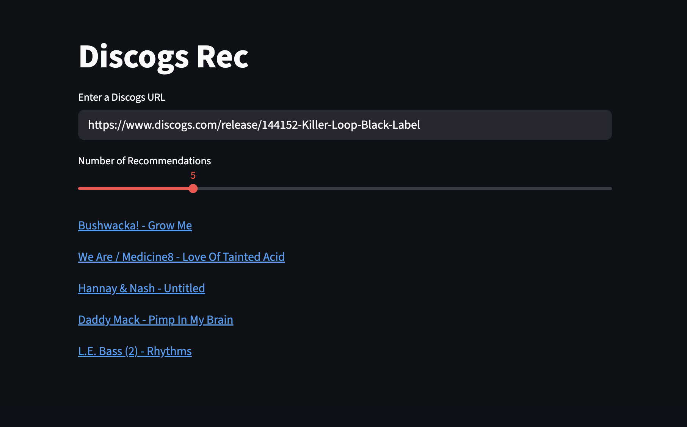

# Discogs Rec API
A FastAPI-based recommendation system that provides Discogs recommendations, alongside various other features. The API uses Spotify's [Annoy](https://github.com/spotify/annoy) library for fast approximate nearest neighbor search to find similar releases based on release metadata. If you would like to see the code used to train the model, see [discogs-rec-model](https://github.com/justinpakzad/discogs-rec-model).

## Features
- **Recommendations**: Get similar releases based on Discogs URLs or release IDs
- **Batch Recommendations**: Get multiple recommendations in a single request
- **Recommendation History**: Users can view their past recommendations
- **Search History**: Users can view their past recommendation queries
- **Release Filtering**: Fetch releases by number of wants, haves, and various other filters
- **Favorites**: Save and manage favorite releases/recommendations
- **User Feedback**: Users can leave feedback on the recommended records
- **User Management**: Registration, authentication, and user profiles  
- **Release Metadata**: Including artist, title, label, year, country, styles, wants, haves, pricing data
- **Authentication**: JWT-based authentication with refresh tokens
### Installation & Setup

#### Prerequisites
- Docker and Docker Compose

#### Quick Start
1. Clone the repository:
```bash
git clone https://github.com/justinpakzad/discogs-rec-api
```

2. Choose your setup option:

#### Option 1: Use Pre-trained Model (Recommended)
Download the pre-trained model and setup the database automatically:
```bash
docker compose up setup
```
*Note: This downloads a large model file so it may take a few minutes.*

Then start the API:
```bash
docker compose up discogs_rec_api -d
```

#### Option 2: Train Your Own Model
If you want to train a custom model:
1. Train your model using the [discogs-rec-model repository](https://github.com/justinpakzad/discogs-rec-model)
2. Place the generated data folder in the `./ml/data/` directory 
3. Run the minimal setup to prepare the database and load the release data:
```bash
docker compose run --rm setup python setup_scripts/main.py --minimal
```

4. Start the API:
```bash
docker compose up discogs_rec_api -d
```

#### Running Tests

Run all tests (unit + integration):
```bash
docker compose run --rm tests
```

Run only unit tests:
```bash
docker compose run --rm tests pytest tests/unit_tests/ -v
```

Run only integration tests:
```bash
docker compose run --rm tests pytest tests/integration_tests/ -v
```

The API will be available at `http://localhost:8000`


## API Overview


### Examples

```bash
# get recommendations for a discogs release
POST /recommend
Content-Type: application/json
{
  "url": "https://www.discogs.com/release/335130",
  "n_recs": 5
}

# get batch recommendations for multiple releases
POST /recommend/batch
Content-Type: application/json
{
  "urls": [
    "https://www.discogs.com/release/335130",
    "https://www.discogs.com/release/926397"
  ],
  "n_recs": 3
}

# search releases with advanced filters
GET /releases
params = {
  "want_min": 200,
  "have_max": 100,
  "styles": ["Electro","Techno"],
  "release_year_min": 1990,
  "release_year_max": 1999,
  "page": 1,
  "limit": 10
}

# get specific release details
GET /releases/123456

# register a new user
POST /auth/register
Content-Type: application/json
{
  "username": "user",
  "email": "user@example.com",
  "password": "mypassword123"
}

# add a release to favorites (requires authentication)
POST /user/me/favorites/123456
Authorization: Bearer {your_token}

# view your recommendation history
GET /user/me/recommendations?page=1&limit=10
Authorization: Bearer {your_token}

# view your search history
GET /user/me/searches?page=1&limit=10
Authorization: Bearer {your_token}
```

### Authentication
Most endpoints require a Bearer token in the Authorization header. Get your token by registering and logging in through `/auth/register` and `/auth/login`.
### Response Format
All successful responses return JSON.

**Single recommendations** return a search ID (for authenticated users) and recommendations with artist, title, label, and Discogs URL:

```json
{
  "search_id": 45,
  "recommendations": [
    {
      "url": "https://www.discogs.com/release/926397",
      "artist_name": "Artist", 
      "release_title": "Release",
      "label_name": "Label"
    }
  ]
}
```

For anonymous users, the `search_id` field is omitted:

```json
{
  "recommendations": [
    {
      "url": "https://www.discogs.com/release/926397",
      "artist_name": "Artist", 
      "release_title": "Release",
      "label_name": "Label"
    }
  ]
}
```

**Batch recommendations** return input data with recommendations and search IDs:

```json
[
  {
    "search_id": 43,
    "input_data": {
      "release_id": 335130,
      "url": "https://www.discogs.com/release/335130-FL-Untitled"
    },
    "recommendations": [
      {
        "url": "https://www.discogs.com/release/127580",
        "artist_name": "Subversiv' Effigies",
        "release_title": "Strictly Unreal",
        "label_name": "Global Cuts"
      }
    ]
  },
  {
    "search_id": 44,
    "input_data": {
      "release_id": 926397,
      "url": "https://www.discogs.com/release/926397-Daily-Air-Cargo-Pacific-Deliveries"
    },
    "recommendations": [
      {
        "url": "https://www.discogs.com/release/1186064",
        "artist_name": "Libe",
        "release_title": "Wonderful Trip", 
        "label_name": "Noise Art"
      }
    ]
  }
]
```

### Full API Documentation
Complete endpoint documentation with request/response schemas is available at:
- http://localhost:8000/redoc
- http://localhost:8000/docs


## Streamlit App
I built a mini streamlit app which can be used to get recommendations via a UI. The app is very basic and does not include many of the features available directly via the API. To start streamlit run:
```bash
docker compose up streamlit -d
```



## Model Information
Genres supported:
- Electronic 
- Hip-hop 

The model is trained on:
- Discogs data dumps 
- Scraped release metadata (wants, haves, ratings, prices, etc)

Note: Some of the data was scraped a while ago so the wants, haves, and price data might not fully reflect the current state of the releases.

## Contributing
Any contributions are welcome, please feel free to submit a Pull Request.  
How to contribute:
1. Fork the repository
2. Create a feature branch 
3. Commit your changes 
4. Push to the branch 
5. Open a Pull Request

